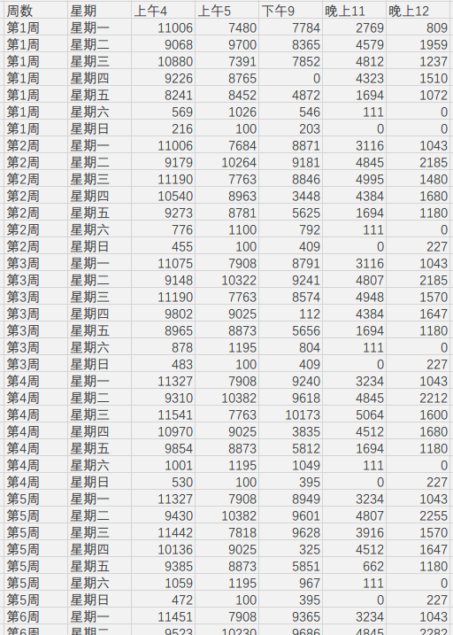

基于课程表的餐点人数统计
===

面向学校餐饮中心，根据学生的课程表来统计每个餐点的**用餐大约人数**。


支持**导出为Excel**，为了方便开发，没有直接对Excel进行操作，而是生成能粘贴到Excel的字符串。导出结果：



**餐点**分别有：

- 上午第 4 节课放学
- 上午第 5 节课放学
- 下午第 9 节课放学
- 晚上第 11 节课放学
- 晚上第 12 节课放学

这些餐点所在课程数以及输入格式以*浙江农林大学*为准，即：满课的情况下，上午5节课、下午4节课、晚上3节课。


---


若格式有变动，可在下方代码中修改：

`ShowWindow.cpp`

**餐点人数统计结果 结构体**：

```C++
struct DayNums {
    int m4, m5, a9, n11, n12;
};
```

**通过课程对象判断是否符合餐点**：

```C++
/**
 * 获取某一天的情况
 * @param week 周数
 * @param day  周几
 * @return     一天餐点的人数
 */
ShowWindow::DayNums ShowWindow::getDayNums(int week, int day)
{
    DayNums dn;

    // 遍历每一个课程
    for (int i = 0; i < clss.size(); i++)
    {
        Cls cls = clss.at(i);

        // 判断周的范围
        if (cls.start_week > week || cls.end_week < week)
            continue;

        // 判断单双周
        if (cls.dual && week & 1)
            continue;
        if (cls.single && !(week & 1))
            continue;

        // 判断周几
        if (cls.day != day)
            continue;

        // 判断课程时间：上午4
        if (cls.end_course == 4)
            dn.m4 += cls.member;
        // 判断课程时间：上午5
        if (cls.end_course == 5)
            dn.m5 += cls.member;
        // 判断课程时间：下午9
        if (cls.end_course == 9)
            dn.a9 += cls.member;
        // 判断课程时间：晚上11
        if (cls.end_course == 11)
            dn.n11 += cls.member;
        // 判断课程时间：晚上12
        if (cls.end_course == 12)
            dn.n12 += cls.member;
    }

    return dn;
}
```


---


课程对象，不是一个具体的课程，而是某个课程某个时间段的具体情况。即一门课可能会有多个不连续上课时间，就是多个课程对象。

**课程对象 结构体**：

```C++
struct Cls {
    int start_week, end_week;      // 第几周单位
    int day;                       // 周日~周六，0~6
    int start_course, end_course;  // 课程范围：第1~12节课
    bool dual;                     // 双周
    bool single;                   // 单周
    int member;                    // 人数
};
```

通过用户输入的字符串来**提取课程对象**算法：

```C++
/**
 * 添加一个具体的课程对象
 * @param time 唯一时间
 * @param numb 唯一人数
 * @return     课程对象
 */
ShowWindow::Cls ShowWindow::clsFromString(QString time, QString numb)
{
    Cls cls;
    cls.member = numb.toInt();

    // 去掉“星期”
    time = time.replace("星期", "周");

    // 判断单双周
    if (time.indexOf("|双周") > -1)
    {
        cls.dual = true;
        time = time.replace("|双周", "");
    }
    if (time.indexOf("(双)") > -1)
    {
        cls.dual = true;
        time = time.replace("(双)", "");
    }
    if (time.indexOf("（双）") > -1)
    {
        cls.dual = true;
        time = time.replace("（双）", "");
    }
    if (time.indexOf("|单周") > 1)
    {
        cls.dual = true;
        time = time.replace("|单周", "");
    }
    if (time.indexOf("（单）") > 1)
    {
        cls.dual = true;
        time = time.replace("（单周）", "");
    }
    if (time.indexOf("(单)") > 1)
    {
        cls.dual = true;
        time = time.replace("(单)", "");
    }

    // 判断格式、使用正则表达式捕获对应位置
    QRegExp re("周(.)第?([\\d,-]+)节\\{第?(\\d+)-(\\d+)周\\}");
    if (!re.exactMatch(time))
    {
        // 特判：周二第3-4节{17周}
        re.setPattern("周(.)第?([\\d,-]+)节\\{第?(\\d+)周\\}");
        if (!re.exactMatch(time))
        {
            qDebug() << "无法正则匹配时间：" << time;
            return cls;
        }
    }
    QStringList ress = re.capturedTexts();
//    qDebug() << "capturedTexts:" << ress; // 调试输出匹配结果

    // 判断第几周
    QString week = re.capturedTexts().at(1);
    cls.day = weekDayTrans(week);

    // 判断课程范围，可能是 1,2  也可能是 3-5
    QStringList courses = ress.at(2).split(QRegExp("[,-]"));
    cls.start_course = courses.first().toInt();
    cls.end_course = courses.last().toInt();

    // 判断上课时间
    cls.start_week = ress.at(3).toInt();
    if (ress.size() > 4)
        cls.end_week = ress.at(4).toInt();
    else
        cls.end_week = cls.start_week;

//    qDebug() << cls.toString();
    return cls;
}
```

